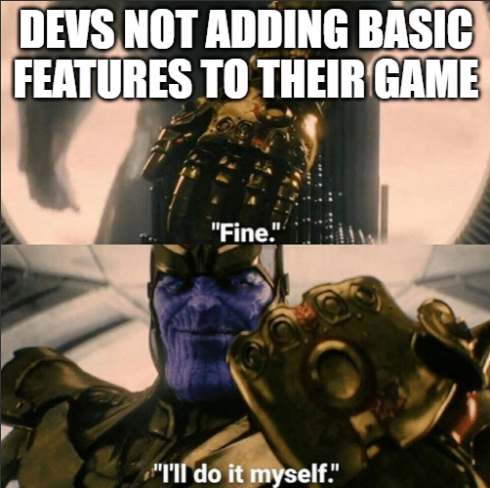
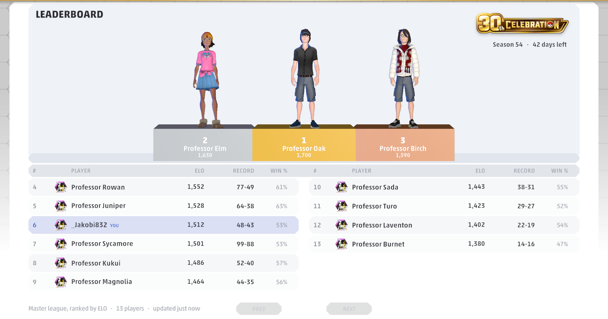
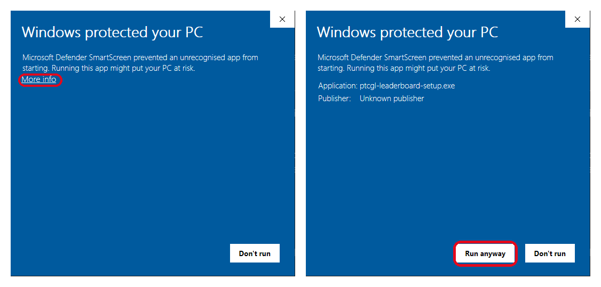
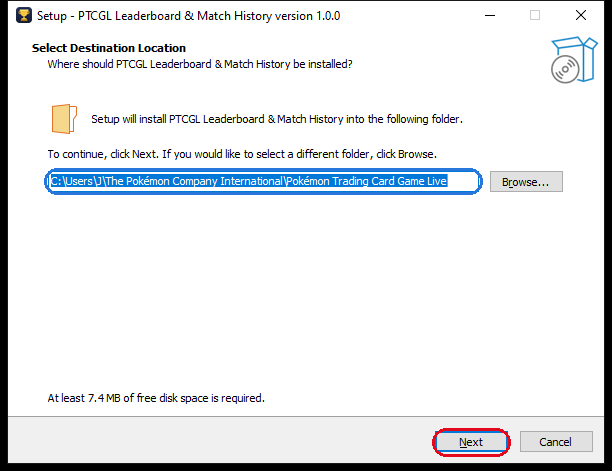
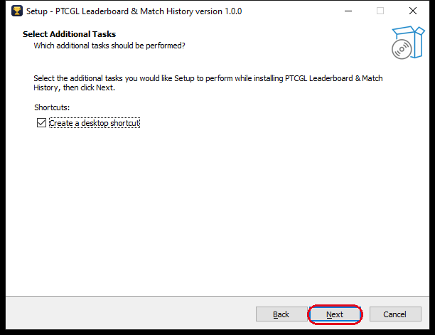
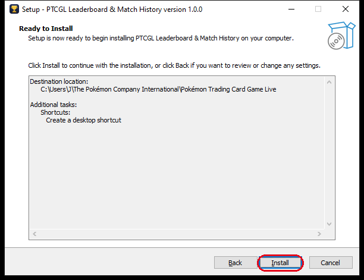
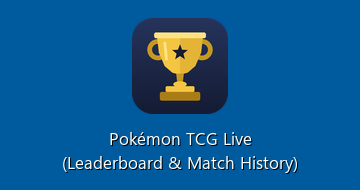
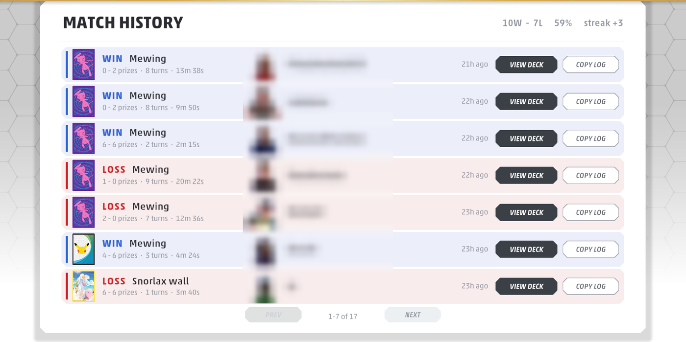
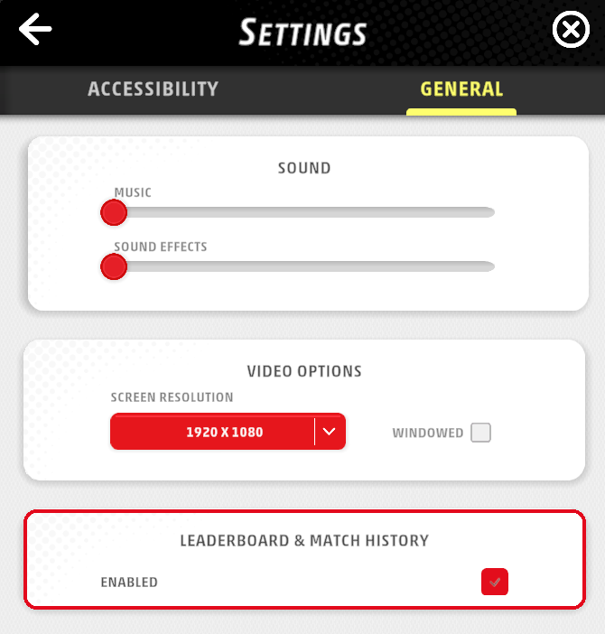

# PTCGL Leaderboard & Match History

# [📖 Installation guide →](#installing)

**[Source code](https://github.com/Jxkobyte/PtcglLeaderboard)**   ·   Discord: **jakobi_**

A mod for **Pokémon TCG Live** that adds two things the game should have had from the start: a
**Match History** of every game you play, and a community **Leaderboard** for the ranked season,
with the top three on a 3D podium. Free and open source (MIT).

## Installing

It only works in the menus. It shows nothing and changes nothing during a match, so there's no
in-match advantage.

**You need:** Windows 10 or 11, with Pokémon TCG Live installed from the official website. No admin
rights are needed. Install takes about a minute.

---

### 1. Download

Download **`ptcgl-leaderboard-setup.exe`** from the
[latest release](https://github.com/Jxkobyte/ptcgl-leaderboard/releases/latest).

**Close Pokémon TCG Live before you continue.**

### 2. Get past the Windows warning

The installer isn't code-signed, because a signing certificate costs hundreds of dollars a year.
So Windows shows a blue **"Windows protected your PC"** box the first time you run it. Click
**More info**, then **Run anyway**.

The mod is **open source**, so you don't have to take that on trust: every line of it is public
at [github.com/Jxkobyte/PtcglLeaderboard](https://github.com/Jxkobyte/PtcglLeaderboard).

### 3. Run the installer

**Choose the game folder.** The usual folder is filled in for you, so click **Next**. If you
installed the game somewhere else, click **Browse** and pick the folder that has
`Pokemon TCG Live.exe` in it. The installer won't continue until the folder is right.

**Desktop shortcut.** Leave this ticked (see step 4 for why), then click **Next**.

**Install.** Click **Install**, then **Finish**.

### 4. Always start the game from the new shortcut

The installer adds this shortcut to your desktop and Start menu:

**Use this one instead of your usual Pokémon TCG Live shortcut.** It starts the same game. It also
checks that the mod is still installed, because a game update can sometimes remove it. If an update
removes it while the game is starting, the shortcut puts it back and offers to restart the game for
you.

Your old shortcut still works, but if you use it and an update removes the mod, you'll just see the
plain game until you use the new shortcut again.

### 5. What you'll see

Two new tabs in the top bar:

**Match History** lists every game you play: win or loss, prizes, turns, how long it took, your
opponent's deck (**View Deck**) and the battle log (**Copy Log**). Games are recorded from the
moment the mod is installed; older games can't be recovered.

**Leaderboard** ranks Master league players who use the mod by ELO for the current season, with the
top three on the podium. Your row is highlighted. The rows named after Pokémon Professors (Oak,
Elm, Birch, …) are sample entries, so the board isn't empty while it fills up.

## Turning it off

**Settings → General → Leaderboard & Match History → Enabled.** Untick it and the mod switches off
completely, apart from this checkbox so you can switch it back on. This card isn't shown in the
settings you open during a match.

---

## What is shared

Only your **own** season record goes to the leaderboard: your in-game name, rank points (ELO and
season exp), wins and losses, and the outfit your avatar is wearing (so it can stand on the podium).
You're identified by a random ID the mod creates, not your Pokémon Trainer Club account.

Nothing about your opponents is ever sent: not their names, decks or games. Your match history stays
on your computer, in `%LOCALAPPDATA%\PtcglLeaderboard`.

## Will I get banned for using this?

**Most likely no.** Nobody can promise it, but here's why the risk is low.

- **I've been modding the game for over a year without a ban**, and I'm not aware of anyone being
  banned for using mods like this. Pokémon TCG Live has no anti-cheat that looks for them.
- **It's built to give no advantage.** During a match it only notes that one started and how it
  ended: it doesn't show you anything, doesn't automate anything, and doesn't change cards, decks or
  games. It sends nothing to The Pokémon Company. The only thing it sends anywhere is your own season
  record, to this mod's leaderboard.
- **But it is a modification of the game**, and game terms generally don't allow third-party mods,
  so using this (like any mod) is technically against them. The Pokémon Company could change how
  they handle that at any time.

If that risk isn't for you, don't install it. If you do and change your mind, uninstalling puts the
game back exactly as it was.

## Updating

When a new version comes out, the **Leaderboard & Match History** shortcut tells you as you start
the game (it checks at most once a day). Click **Yes** to open the download page, then run the new
installer over the top. Your match history and leaderboard spot are kept.

## Uninstalling

**Settings → Apps → PTCGL Leaderboard & Match History → Uninstall** (or use the uninstaller in the
Start menu). The game goes back to normal. Your match history is kept in
`%LOCALAPPDATA%\PtcglLeaderboard`, so reinstalling picks up where you left off; delete that folder
if you want it gone as well.

## Troubleshooting

**The new tabs don't appear.** Start the game from the **Leaderboard & Match History** shortcut. If
they're still missing, close the game and run the installer again. That always repairs it.

**My antivirus flagged the installer.** Some antivirus programs are wary of any unsigned program
that adds files to a game folder, which is exactly what a mod has to do. It only ever changes files
inside the Pokémon TCG Live folder and `%LOCALAPPDATA%\PtcglLeaderboard`, and it's open source, so
you (or anyone) can [check exactly what it does](https://github.com/Jxkobyte/PtcglLeaderboard).

**The tabs stopped appearing after a game update.** Close the game and start it from the new
shortcut. It repairs the install before the game opens.

---

## Questions, bugs, ideas

Message me on Discord: **jakobi_**

## Licence

The mod is MIT-licensed; its source is at [Jxkobyte/PtcglLeaderboard](https://github.com/Jxkobyte/PtcglLeaderboard). The installer
also contains BepInEx, Unity Doorstop, HarmonyX, MonoMod and Mono.Cecil, each under its own licence
- see [THIRD-PARTY-NOTICES.md](THIRD-PARTY-NOTICES.md).

*Unofficial fan-made mod. Not affiliated with, endorsed by, or connected to The Pokémon Company,
Nintendo, Creatures or GAME FREAK. Pokémon and Pokémon TCG Live are trademarks of their respective
owners. Use at your own risk.*
